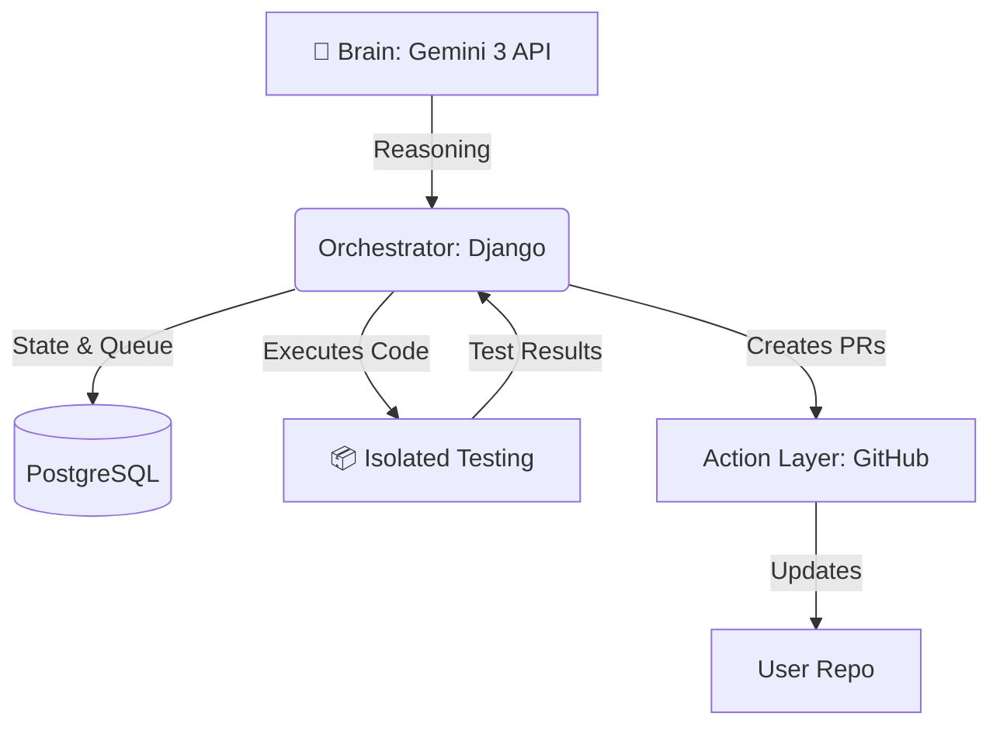

<div align="center">

# 🛠️ Fixit: The Autonomous Maintenance Agent

**State-Aware Security Agent for the "Action Era" of AI**

[](https://www.python.org/)
[](https://www.djangoproject.com/)
[](https://deepmind.google/technologies/gemini/)
[](https://www.postgresql.org/)
[](https://www.docker.com/)

---

<p align="center">
  <em>Built for the Gemini Hackathon (Marathon Agent Track)</em><br>
  <b>Fixit</b> is engineered to handle hours of autonomous codebase auditing without human intervention.
</p>

</div>

## 📖 About

**Fixit** is an autonomous, state-aware security agent designed for the "Action Era" of AI. It doesn't just find vulnerabilities—it **proves** them, **fixes** them, and **validates** the repairs through long-running, self-correcting loops.

## 🚀 Key Features

### 1. The Sentinel Loop (Marathon Continuity)
> **Problem:** Typical AI tools lose context or crash during long tasks.  
> **Solution:** A **Persistent State Machine**.

Every step—from the initial scan to the final Pull Request—is recorded in a **PostgreSQL database**. If the process is interrupted, Fixit resumes **exactly where it left off**.

### 2. Verify-First Protocol (Zero Hallucination)
Fixit follows a strict **"Show, Don't Just Tell"** policy:

| Phase | Action | Description |
| :--- | :--- | :--- |
| **1. Identify** | 🔍 Detect | Detects a potential security flaw. |
| **2. Prove** | 🧪 Test | Writes a **Unit Test (failing)** to demonstrate the exploit. |
| **3. Patch** | 🛠️ Fix | Generates a code fix. |
| **4. Validate** | ✅ Verify | Runs the test again. The fix is verified **only if the test passes**. |

### 3. Autonomous Self-Correction
If a generated fix fails the validation tests or breaks the build:
1. Fixit **analyzes** the error logs.
2. **Adjusts** its strategy.
3. **Tries again** (up to 1 retry).  
*This mimics the iterative workflow of a human Senior Engineer.*

### 4. In-Memory Testing
Fixit uses an innovative approach to test fixes without cloning repositories:
- Original code is stored during analysis
- Tests run in isolated temporary directories
- No disk space wasted on cloned repos
- Faster execution and better security

---

## 🏗️ Architecture



- **Brain**: Powered by **Gemini 3 API** for deep reasoning and long-context codebase analysis.
- **Orchestrator (Django)**: Manages the state machine, task queuing, and persistent memory.
- **Isolated Testing**: In-memory temporary environments where Fixit safely executes and tests code.
- **Action Layer**: GitHub Integration for automated Pull Request (PR) creation.

### 🔑 Key Implementation Details

**In-Memory Testing (No Cloning Required)**
- Original code is stored in the database during analysis
- Tests run in isolated temporary directories
- Fixed code and test code are written to temp files
- Tests execute in isolation, then cleanup automatically
- No need to clone entire repositories to disk

**AI Coordination**
- Test generator sees original code to write accurate imports
- Fix generator sees the same code to create proper fixes
- Both coordinate through shared context for consistency

---

## 📅 Development Roadmap

- [x] **Week 1: Foundation** - Persistent State Machine & Repo Ingestion.
- [x] **Week 2: The Auditor** - Deep scanning and Vulnerability Identification.
- [x] **Week 3: The Prover** - Automated Unit Test generation for proof-of-concept.
- [x] **Week 4: The Fixer** - Self-correcting patches and validation loops.
- [ ] **Week 5: The Marathon** - 6-hour autonomous stress tests on large-scale repositories.

---

## 🛠️ Tech Stack

| Component | Technology |
| :--- | :--- |
| **Language** | Python 3.10+ |
| **Framework** | Django 5.0 (REST Framework) |
| **AI Model** | Gemini 3 API |
| **Database** | PostgreSQL |
| **Testing** | pytest (Isolated Environments) |
| **Version Control** | GitHub API Integration |

---

## 🚀 Getting Started

### Prerequisites
- Python 3.10+
- PostgreSQL
- Git
- Gemini API Key
- GitHub Bot Token

### Installation

1. **Clone the repository**
```bash
git clone https://github.com/yourusername/fixit.git
cd fixit
```

2. **Set up virtual environment**
```bash
python -m venv .venv
source .venv/bin/activate  # On Windows: .venv\Scripts\activate
```

3. **Install dependencies**
```bash
pip install -r requirements.txt
```

4. **Configure environment variables**
Create a `.env` file in the project root:
```env
GEMINI_API_KEY=your_gemini_api_key_here
GITHUB_BOT_TOKEN=your_github_token_here
```

5. **Set up database**
```bash
python manage.py migrate
```

6. **Create superuser**
```bash
python manage.py createsuperuser
```

7. **Run the server**
```bash
python manage.py runserver
```

### Usage

1. **Add a repository**
```bash
curl -X POST http://localhost:8000/api/create/repository/ \
-H "Content-Type: application/json" \
-d '{"repo_url": "https://github.com/username/repo"}'
```

2. **Verify and fix vulnerabilities**
```bash
curl -X POST http://localhost:8000/api/tasks/{task_id}/verify-and-fix/ \
-H "Content-Type: application/json" \
-d '{"create_pr": true}'
```

3. **Monitor progress**
Visit `http://localhost:8000/admin` to view tasks, logs, and PRs.

---

<div align="center">
  <sub>Built with ❤️ by the Fixit Team</sub>
</div>