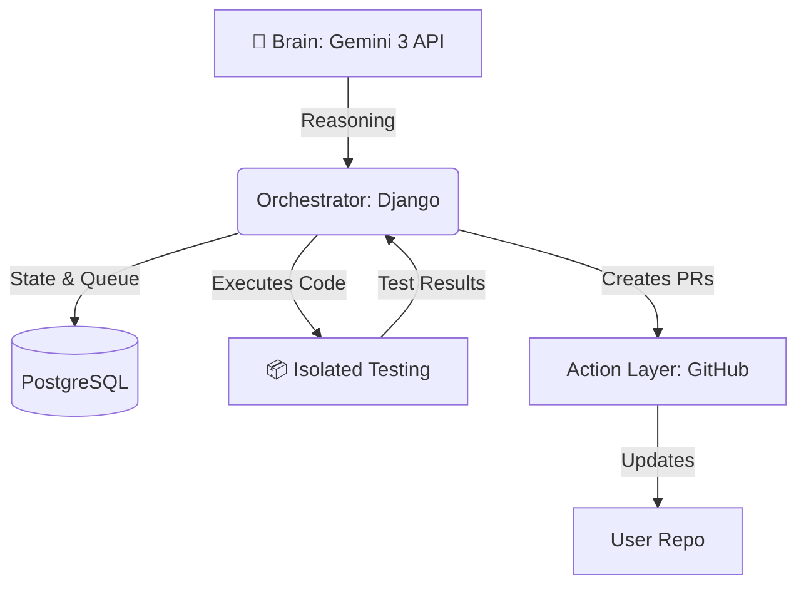

<div align="center">

# 🛠️ Fixit: The Autonomous Security Agent

**State-Aware AI Agent for Continuous Security Maintenance**

[](https://www.python.org/)
[](https://www.djangoproject.com/)
[](https://reactjs.org/)
[](https://deepmind.google/technologies/gemini/)
[](https://www.postgresql.org/)
[](https://redis.io/)
[](https://channels.readthedocs.io/)

---

<p align="center">
  <em>Built for the Gemini API Developer Competition</em><br>
  <b>Fixit</b> autonomously scans codebases, verifies vulnerabilities, generates fixes, and creates pull requests—all without human intervention.
</p>

[🎥 Demo Video](#) • [📚 Documentation](#documentation) • [🚀 Quick Start](#-quick-start)

</div>

---

## 📖 Table of Contents

- [About](#-about)
- [Key Features](#-key-features)
- [Architecture](#-architecture)
- [Tech Stack](#-tech-stack)
- [Quick Start](#-quick-start)
- [How It Works](#-how-it-works)
- [API Documentation](#-api-documentation)
- [Real-Time Features](#-real-time-features)
- [Testing](#-testing)
- [Deployment](#-deployment)
- [Contributing](#-contributing)
- [License](#-license)

---

## 📖 About

**Fixit** is an autonomous AI-powered security agent that revolutionizes how development teams handle security vulnerabilities. Unlike traditional static analysis tools that simply report issues, Fixit takes action:

🔍 **Scans** your codebase for security vulnerabilities  
🧪 **Verifies** each vulnerability with automated tests  
🛠️ **Generates** production-ready fixes  
✅ **Validates** fixes work correctly  
🚀 **Creates** pull requests automatically  
📊 **Tracks** everything with real-time progress updates

### Why Fixit?

**The Problem:**
- Security scanners generate false positives
- Developers spend hours manually fixing vulnerabilities
- Fixes often break existing functionality
- No automated verification that fixes actually work

**The Solution:**
Fixit implements a **verify-first workflow** that ensures every fix is:
1. ✅ Proven to address a real vulnerability (not a false positive)
2. ✅ Tested to work correctly
3. ✅ Ready for production deployment

---

## 🚀 Key Features

### 1. 🔍 Intelligent Vulnerability Detection
- **Deep Code Analysis**: Uses Gemini 3 to analyze entire codebases
- **Context-Aware**: Understands code relationships and data flow
- **Multi-Language Support**: Python, JavaScript, and more
- **Common Vulnerabilities**: SQL Injection, XSS, Path Traversal, Insecure Deserialization, etc.

### 2. 🧪 Verify-First Protocol (Zero False Positives)
Fixit doesn't just report vulnerabilities—it **proves** they exist:

```
┌─────────────────────────────────────────────────────────┐
│  VERIFY-FIRST WORKFLOW                                  │
├─────────────────────────────────────────────────────────┤
│  1. Generate Test → Prove vulnerability exists          │
│  2. Run Test → Should FAIL (confirms vulnerability)     │
│  3. Generate Fix → Create secure code                   │
│  4. Run Test Again → Should PASS (confirms fix works)   │
│  5. Create PR → Only if verified                        │
└─────────────────────────────────────────────────────────┘
```

**Benefits:**
- ✅ Eliminates false positives automatically
- ✅ Ensures fixes actually work
- ✅ Provides test coverage for every fix
- ✅ Builds confidence in automated changes

### 3. 🔄 Self-Correcting with Retry Logic
If a fix doesn't work:
1. Fixit analyzes why it failed
2. Generates an improved fix
3. Retries verification
4. Marks as false positive if still failing

*This mimics how senior engineers debug and iterate.*

### 4. 🎯 In-Memory Testing (No Cloning Required)
**Innovation**: Tests run without cloning repositories!

- Original code stored during analysis
- Tests execute in isolated temporary directories
- No disk space wasted
- Faster execution
- Better security isolation

### 5. 📊 Real-Time Progress Tracking
**WebSocket-powered live updates:**
- See files being analyzed in real-time
- Watch vulnerabilities being discovered
- Monitor fix generation progress
- Track PR creation status

**Technologies:**
- Django Channels for WebSocket support
- Redis for message broadcasting
- React frontend with live updates

### 6. 🤖 Autonomous PR Creation
**Fully automated GitHub integration:**
- Creates feature branches automatically
- Commits fixes with descriptive messages
- Generates comprehensive PR descriptions
- Includes vulnerability details and test code
- Links back to analysis session

### 7. 💾 Persistent State Management
**Never lose progress:**
- Every step saved to PostgreSQL
- Resume from any interruption
- Checkpoint system for long analyses
- Full audit trail of all actions

### 8. ⚡ Asynchronous Task Processing
**Powered by Celery:**
- Background processing for long-running tasks
- Parallel vulnerability analysis
- Queue management for batch operations
- Retry logic for failed tasks

---

## 🏗️ Architecture


```mermaid
graph TD
    A[🧠 Brain: Gemini 3 API] -->|Reasoning| B(Orchestrator: Django);
    B -->|State & Queue| C[(PostgreSQL)];
    B -->|Executes Code| D[📦 Isolated Testing];
    B -->|Creates PRs| E[Action Layer: GitHub];
    D -->|Test Results| B;
    E -->|Updates| F[User Repo];
```

- **Brain**: Powered by **Gemini 3 API** for deep reasoning and long-context codebase analysis.
- **Orchestrator (Django)**: Manages the state machine, task queuing, and persistent memory.
- **Isolated Testing**: In-memory temporary environments where Fixit safely executes and tests code.
- **Action Layer**: GitHub Integration for automated Pull Request (PR) creation.

### 🔑 Key Implementation Details

**In-Memory Testing (No Cloning Required)**
- Original code is stored in the database during analysis
- Tests run in isolated temporary directories
- Fixed code and test code are written to temp files
- Tests execute in isolation, then cleanup automatically
- No need to clone entire repositories to disk

**AI Coordination**
- Test generator sees original code to write accurate imports
- Fix generator sees the same code to create proper fixes
- Both coordinate through shared context for consistency

---

## 📅 Development Roadmap

- [x] **Week 1: Foundation** - Persistent State Machine & Repo Ingestion.
- [x] **Week 2: The Auditor** - Deep scanning and Vulnerability Identification.
- [x] **Week 3: The Prover** - Automated Unit Test generation for proof-of-concept.
- [x] **Week 4: The Fixer** - Self-correcting patches and validation loops.
- [ ] **Week 5: The Marathon** - 6-hour autonomous stress tests on large-scale repositories.

---

## 🛠️ Tech Stack

| Component | Technology | Purpose |
| :--- | :--- | :--- |
| **Backend Framework** | Django 5.0 + Django REST Framework | API server and business logic |
| **Frontend** | React 18 + TypeScript + Vite | Modern, responsive UI |
| **AI Model** | Gemini 3 API | Code analysis, vulnerability detection, fix generation |
| **Database** | PostgreSQL | Persistent state storage |
| **Cache & Message Broker** | Redis | Celery task queue and WebSocket channel layer |
| **Task Queue** | Celery | Asynchronous background processing |
| **Real-Time Communication** | Django Channels + WebSockets | Live progress updates |
| **Testing Framework** | pytest | Isolated test execution |
| **Version Control Integration** | GitHub API (PyGithub) | Automated PR creation |
| **Styling** | TailwindCSS | Modern, utility-first CSS |

### System Architecture Diagram

```
┌─────────────────────────────────────────────────────────────────┐
│                         FIXIT SYSTEM                            │
├─────────────────────────────────────────────────────────────────┤
│                                                                 │
│  ┌──────────────┐         ┌──────────────┐                    │
│  │   React UI   │◄────────┤   WebSocket  │                    │
│  │  (Frontend)  │  Live   │   Consumer   │                    │
│  └──────┬───────┘ Updates └──────▲───────┘                    │
│         │                         │                             │
│         │ HTTP/REST              │ Redis                       │
│         ▼                         │ Pub/Sub                    │
│  ┌──────────────┐         ┌──────┴───────┐                    │
│  │    Django    │◄────────┤    Redis     │                    │
│  │  REST API    │         │ Channel Layer│                    │
│  └──────┬───────┘         └──────────────┘                    │
│         │                                                       │
│         │ Enqueue Tasks                                        │
│         ▼                                                       │
│  ┌──────────────┐         ┌──────────────┐                    │
│  │    Celery    │◄────────┤    Redis     │                    │
│  │   Workers    │  Queue  │    Broker    │                    │
│  └──────┬───────┘         └──────────────┘                    │
│         │                                                       │
│         │ Process Tasks                                        │
│         ▼                                                       │
│  ┌──────────────────────────────────────┐                     │
│  │   VerificationOrchestrator           │                     │
│  │  ┌────────────────────────────────┐  │                     │
│  │  │ 1. TestGenerator (Gemini 3)   │  │                     │
│  │  │ 2. TestRunner (pytest)        │  │                     │
│  │  │ 3. FixGenerator (Gemini 3)    │  │                     │
│  │  │ 4. TestRunner (verify)        │  │                     │
│  │  │ 5. GitHub Integration         │  │                     │
│  │  └────────────────────────────────┘  │                     │
│  └──────┬───────────────────────────────┘                     │
│         │                                                       │
│         │ Store Results                                        │
│         ▼                                                       │
│  ┌──────────────┐                                              │
│  │  PostgreSQL  │                                              │
│  │   Database   │                                              │
│  └──────────────┘                                              │
│                                                                 │
└─────────────────────────────────────────────────────────────────┘
```

---

## �  API Documentation

Comprehensive API documentation is available in **[API_DOCUMENTATION.md](./API_DOCUMENTATION.md)**.

The documentation includes:
- **Complete API Reference**: All REST endpoints with request/response examples
- **WebSocket APIs**: Real-time communication protocols
- **Data Models**: TypeScript-style type definitions
- **Workflow Examples**: Step-by-step integration guides
- **Error Handling**: Standard error formats and status codes

### Quick API Overview

| Category | Endpoints | Purpose |
|----------|-----------|---------|
| **Core** | `/api/v1/credentials/validate/` | Validate API credentials |
| **Repository** | `/api/v1/repositories/` | Create and manage repositories |
| **Tasks** | `/api/v1/tasks/{id}/` | Manage vulnerability tasks |
| **Sessions** | `/api/v1/sessions/{id}/status/` | Track analysis progress |
| **WebSocket** | `ws://host/ws/sessions/{id}/` | Real-time updates |

**Example: Start Analysis**
```bash
curl -X POST http://localhost:8000/api/v1/repositories/ \
  -H "Content-Type: application/json" \
  -d '{
    "repo_url": "https://github.com/owner/repo",
    "create_prs": true,
    "gemini_key": "AIzaSy...",
    "github_token": "ghp_..."
  }'
```

**Response:**
```json
{
  "repository": {...},
  "session_id": "550e8400-e29b-41d4-a716-446655440000",
  "message": "Analysis started in background"
}
```

For complete details, see **[API_DOCUMENTATION.md](./API_DOCUMENTATION.md)**.

---

## 🚀 Getting Started

### Prerequisites
- Python 3.10+
- PostgreSQL
- Git
- Gemini API Key
- GitHub Bot Token

### Installation

1. **Clone the repository**
```bash
git clone https://github.com/yourusername/fixit.git
cd fixit
```

2. **Set up virtual environment**
```bash
python -m venv .venv
source .venv/bin/activate  # On Windows: .venv\Scripts\activate
```

3. **Install dependencies**
```bash
pip install -r requirements.txt
```

4. **Configure environment variables**
Create a `.env` file in the project root:
```env
GEMINI_API_KEY=your_gemini_api_key_here
GITHUB_BOT_TOKEN=your_github_token_here
```

5. **Set up database**
```bash
python manage.py migrate
```

6. **Create superuser**
```bash
python manage.py createsuperuser
```

7. **Run the server**
```bash
python manage.py runserver
```

### Usage

1. **Add a repository**
```bash
curl -X POST http://localhost:8000/api/create/repository/ \
-H "Content-Type: application/json" \
-d '{"repo_url": "https://github.com/username/repo"}'
```

2. **Verify and fix vulnerabilities**
```bash
curl -X POST http://localhost:8000/api/tasks/{task_id}/verify-and-fix/ \
-H "Content-Type: application/json" \
-d '{"create_pr": true}'
```

3. **Monitor progress**
Visit `http://localhost:8000/admin` to view tasks, logs, and PRs.

---

<div align="center">
  <sub>Built with ❤️ by the Fixit Team</sub>
</div>
---

## 📚 Complete API Documentation

Fixit provides comprehensive API documentation for hackathon judges and developers:

### 📖 Documentation Suite

| Document | Lines | Purpose |
|----------|-------|---------|
| **[API_DOCUMENTATION.md](./API_DOCUMENTATION.md)** | 873 | Complete API reference with all endpoints, data models, and examples |
| **[API_QUICK_REFERENCE.md](./API_QUICK_REFERENCE.md)** | 217 | Quick curl commands and common workflows |
| **[API_ENDPOINT_MAP.md](./API_ENDPOINT_MAP.md)** | 254 | Visual API structure and flow diagrams |
| **[API_SUMMARY_FOR_HACKATHON.md](./API_SUMMARY_FOR_HACKATHON.md)** | 385 | Executive summary for hackathon evaluation |
| **[DOCUMENTATION_INDEX.md](./DOCUMENTATION_INDEX.md)** | 152 | Complete documentation index |

**Total:** 1,881 lines of professional API documentation

### 🎯 Quick Links

- **For Judges:** Start with [API_SUMMARY_FOR_HACKATHON.md](./API_SUMMARY_FOR_HACKATHON.md)
- **For Developers:** Start with [API_DOCUMENTATION.md](./API_DOCUMENTATION.md)
- **For Testing:** Use [API_QUICK_REFERENCE.md](./API_QUICK_REFERENCE.md)
- **For Architecture:** Review [API_ENDPOINT_MAP.md](./API_ENDPOINT_MAP.md)

### ✨ API Highlights

- **15 REST Endpoints** - Complete CRUD operations
- **1 WebSocket Endpoint** - Real-time updates
- **5 API Categories** - Organized by functionality
- **Async Processing** - Celery-powered background tasks
- **Type Safety** - TypeScript-style data models
- **Error Handling** - Comprehensive error responses

