# 🛠️ Fixit: The Autonomous Maintenance Agent

**State-Aware Security Agent for the "Action Era" of AI**

---

  <em>Built for the Gemini Hackathon (Marathon Agent Track)</em> 
  <b>Fixit</b> is engineered to handle hours of autonomous codebase auditing without human intervention.

## 📖 About

**Fixit** is an autonomous, state-aware security agent designed for the "Action Era" of AI. It doesn't just find vulnerabilities—it **proves** them, **fixes** them, and **validates** the repairs through long-running, self-correcting loops.

## 🚀 Key Features

### 1. The Sentinel Loop (Marathon Continuity)
> **Problem:** Typical AI tools lose context or crash during long tasks.  
> **Solution:** A **Persistent State Machine**.

Every step—from the initial scan to the final Pull Request—is recorded in a **PostgreSQL database**. If the process is interrupted, Fixit resumes **exactly where it left off**.

### 2. Verify-First Protocol (Zero Hallucination)
Fixit follows a strict **"Show, Don't Just Tell"** policy:

| Phase | Action | Description |
| :--- | :--- | :--- |
| **1. Identify** | 🔍 Detect | Detects a potential security flaw. |
| **2. Prove** | 🧪 Test | Writes a **Unit Test (failing)** to demonstrate the exploit. |
| **3. Patch** | 🛠️ Fix | Generates a code fix. |
| **4. Validate** | ✅ Verify | Runs the test again. The fix is verified **only if the test passes**. |

### 3. Autonomous Self-Correction
If a generated fix fails the validation tests or breaks the build:
1. Fixit **analyzes** the error logs.
2. **Adjusts** its strategy.
3. **Tries again**.  
*This mimics the iterative workflow of a human Senior Engineer.*

---

## 🏗️ Architecture

```mermaid
graph TD
    A[🧠 Brain: Gemini 3 API] -->|Reasoning| B(Orchestrator: Django);
    B -->|State & Queue| C[(PostgreSQL)];
    B -->|Executes Code| D[📦 Sandbox: Docker];
    B -->|Creates PRs| E[Action Layer: GitHub];
    D -->|Test Results| B;
    E -->|Updates| F[User Repo];
```

- **Brain**: Powered by **Gemini 3 API** for deep reasoning and long-context codebase analysis.
- **Orchestrator (Django)**: Manages the state machine, task queuing, and persistent memory.
- **Sandbox**: An isolated environment where Fixit safely executes and tests code.
- **Action Layer**: GitHub Integration for automated Pull Request (PR) creation.

---

## 📅 Development Roadmap

- [ ] **Week 1: Foundation** - Persistent State Machine & Repo Ingestion.
- [ ] **Week 2: The Auditor** - Deep scanning and Vulnerability Identification.
- [ ] **Week 3: The Prover** - Automated Unit Test generation for proof-of-concept.
- [ ] **Week 4: The Fixer** - Self-correcting patches and validation loops.
- [ ] **Week 5: The Marathon** - 6-hour autonomous stress tests on large-scale repositories.

---

## 🛠️ Tech Stack

| Component | Technology |
| :--- | :--- |
| **Language** | Python |
| **Framework** | Django (REST Framework) |
| **AI Model** | Gemini 3 API |
| **Database** | PostgreSQL |
| **Environment** | Docker (Sandbox Execution) |

---

  Built with ❤️ by the Fixit Team

